# AKS based scalable Jmeter Test Framework with Grafana

### Latest Version: 1.5

## Introduction
This Jmeter based testing framework provides a scalable test harness to support load testing of applications using Apache Jmeter<sup>TM</sup>  based test scripts.  The framework excludes support for writing a Jmeter test plan but assumes a test plan in the form of a jmx files is available.  The testing framework utilizes a master Jmeter node with one or more slave nodes used to run the tests.  The deployment assumes a Jmeter backend listener is configured within the test plan to support writing metrics to the Influx database which can then be presented via a Grafana dashboard.  The initial deployment only deploys a single jmeter-slave pod but can be scaled as needed to support the required number of client threads.

## Architecture

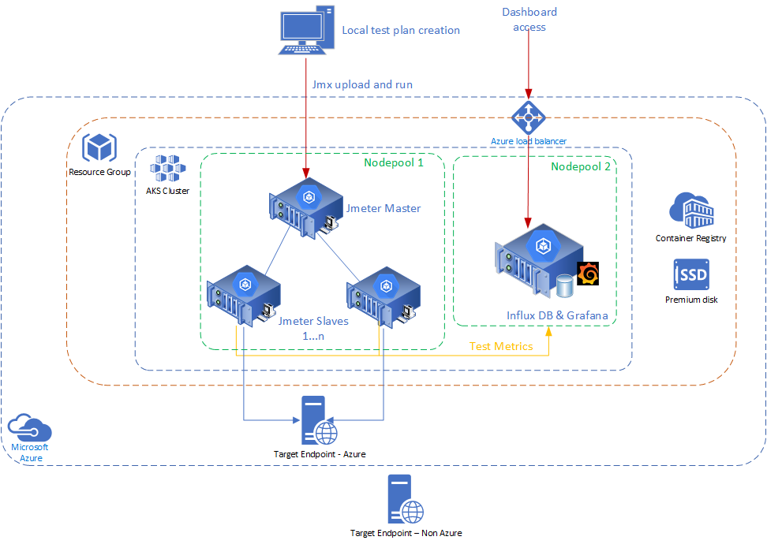

The framework uses a Kubernetes based deployment of Apache Jmeter, InfluxDB and Grafana.  The framework builds on [Apache Jmeter's distributed load testing model](https://jmeter.apache.org/usermanual/jmeter_distributed_testing_step_by_step.html) whereby tests are initiated from a Jmeter master node(1) which then distributes the test script to the slaves (jmeter instances), the slaves are nodes/pods that carry out the load testing. Note: The test plan is replicated to all slaves so consideration of the overall client load is needed.  For example, a test plan with 100 client threads distributed to 5 jmeter slaves will result in 500 active clients. You will use a distributed architecture like this if you want to carry out an intensive load test which can simulate hundreds and thousands of simultaneous users, this is the scenario we will be looking at in this blog post.The results of any load testing are sent to the InfluxDB using the built in BackEndLister available in Jmeter (see test plan construction below) and Grafana is used to render this data in an easily consumable dashboard.


## Installation

### Pre-requisities
- - az cli (version 2.0.80 or above) is installed (assumes use of linux based client not powershell, [Windows Subsystem for Linux](https://docs.microsoft.com/en-us/windows/wsl/install-win10) can be used instead)
- kubectl is installed ( https://kubernetes.io/docs/tasks/tools/install-kubectl/ )


1. Clone the github repo 
2. Navigate to the installs directory
3. Make the install.sh script executable 
    - chmod +x install.sh
4. Running install.sh
    - can we run with the following parameters
        #### validate
        `install.sh validate -g {resource-group-name} -s {service-principal-name} -l {location}`

        - This will validate the target environment, checking resource group, service principal name and AKS

        #### install
        Non Vnet based deployment
        `install.sh install -g {resource-group-name} -s {service-principal-name} -l {location}`

        Existing Vnet based deployment
        `install.sh install -g {resource-group-name} -s {service-principal-name} -l {location} -vnetname {vnet} -subnetname {subnet}`

        New Vnet based deployment
        `install.sh install -g {resource-group-name} -s {service-principal-name} -l {location} -vnetname {vnet} -subnetname {subnet} -v {vnet cidr} -n {subnet cidr}`
      
        - This will deploy to the target environment using the resource group and location defined.  It will create the resource group, service principal, Azure Container Registry, build and upload containers for Jmeter Master, Jmeter Slave and reporting, create an AKS cluster and deploy and configure all the elements required to run a test.

        #### delete
        `install.sh delete -g {resource-group-name} -s {service-principal-name}`
       
        This will remove all resources and the service principal

        #### kube_deploy
        `install.sh kube_deploy -g {resource-group-name} -c {aks-cluster-name}`

        - This will deploy and configure all the kubernetes elements required to deploy pods, configure Influx and Grafana on an existing Test Framework cluster.

5. Once the deployment has completed successfully the Grafana dashboard can be accessed via the public IP of the provisioned loadbalancer.  The easiest way to obtain this is to run
 - kubectl get svc

 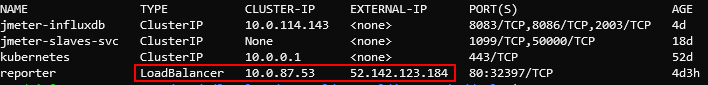

The public IP address of the loadbalancer can then be used to access the Grafana login window ( access with default credentials admin/admin)


### Set up Jmeter Dashboard
Once the Grafana dashboad has been accessed an initial Grafana page should be loaded ( note: a default datasource has already been created )

An initial dashboard has been loaded as part of the installation as :

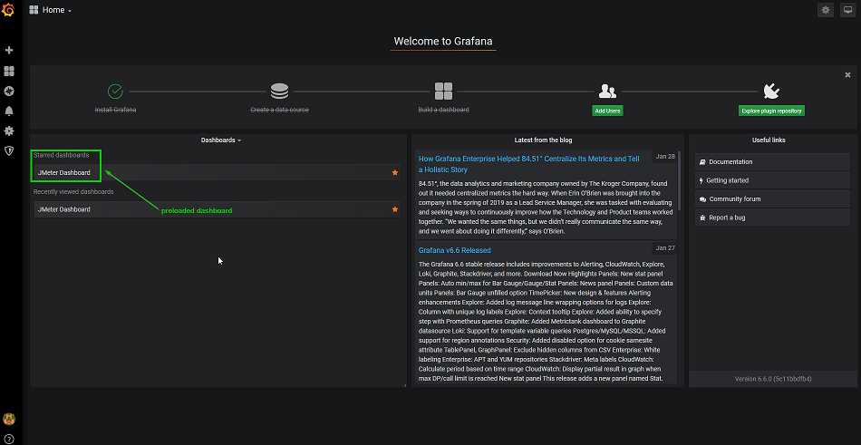

Select the Jmeter dashboard to open the default dashboard to support testing


If no dashboard is available follow the steps below to load a Jmeter dashboard to display testing data

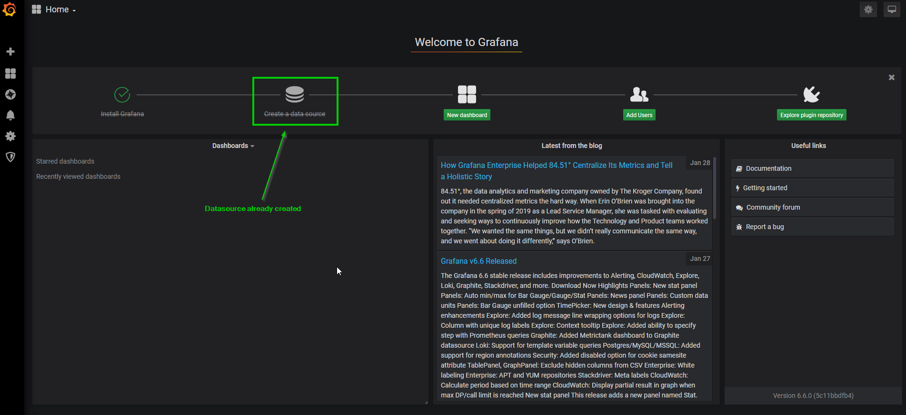

Select Dashboards ....Manage as below:

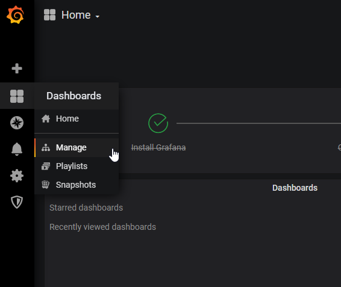

This will open the Dashboard Management Window.....Select "Import"

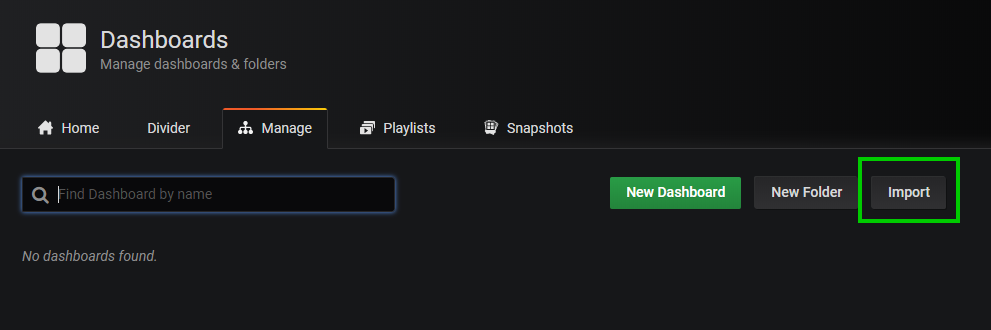

On the Import window enter 4026 as the Id for the dashboard as below

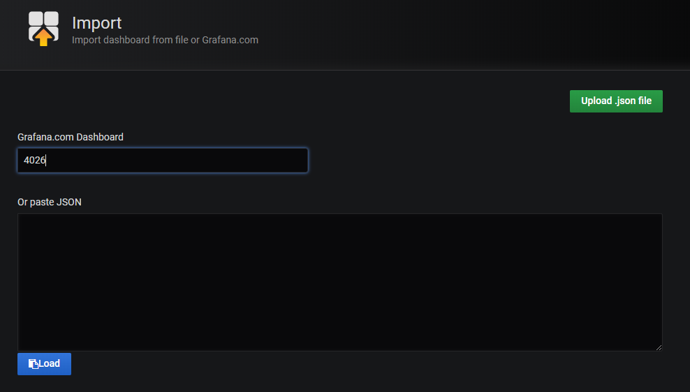

This will import the dashboard from Grafana labs and display the settings dialog as below - update the database name as shown and select Import to load the dashboard

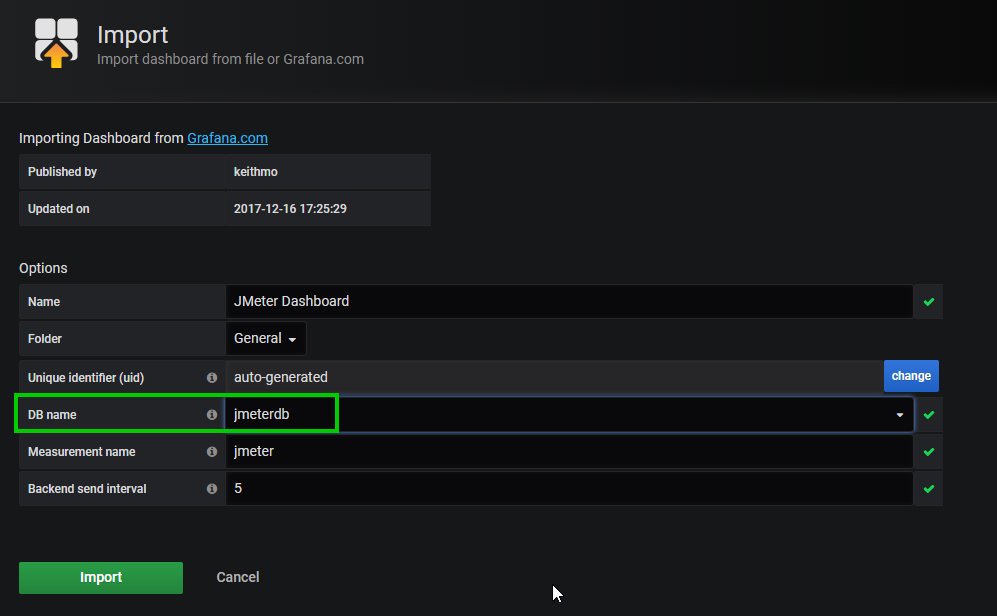

The Grafana Jmeter dashboard will be loaded with the default settings ready for your first Jmeter Test

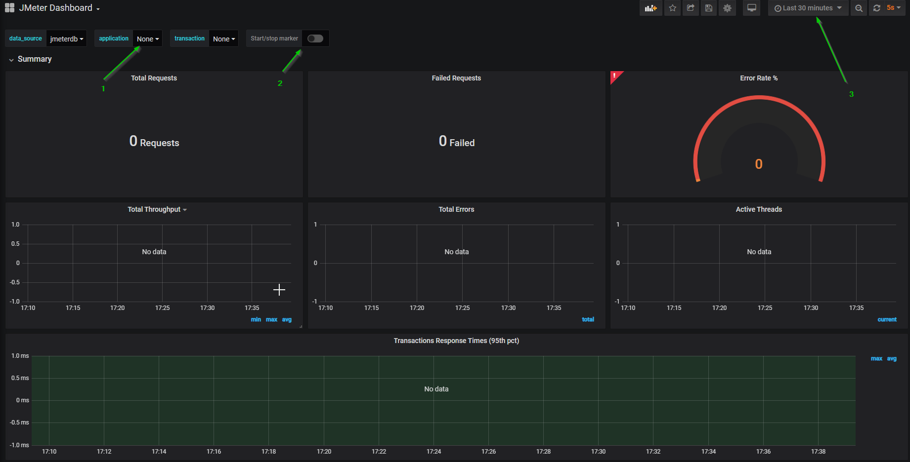


The key items to note are:
1. The application Name - this will be linked to your Jmeter test plan configuration ( see below )
2. Start/Stop marker - this will indicate when a jmeter test is started and stopped
3. Time range - this will define the time period the dashboard displays data for.


## Running your first Jmeter test

To validate the deployment a simple test script has been provided.  To run this test navigate to the deploy directory.  To run any tests the file starttest.sh is used in the form:
- make the file starttest.sh executable 
```
chmod +x starttest.sh
```
- to execute a test run
```
./starttest.sh {testfilename}
```
for the example test script:
```
./starttest.sh simple.jmx
```
Example output will show the testplan being "distributed" to a single node ( as there is only 1 slave node with the default install )

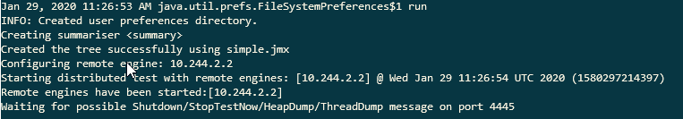

If you navigate to the Grafana dashboard you will see output data similar to:  (note:  change the timerange and application name)

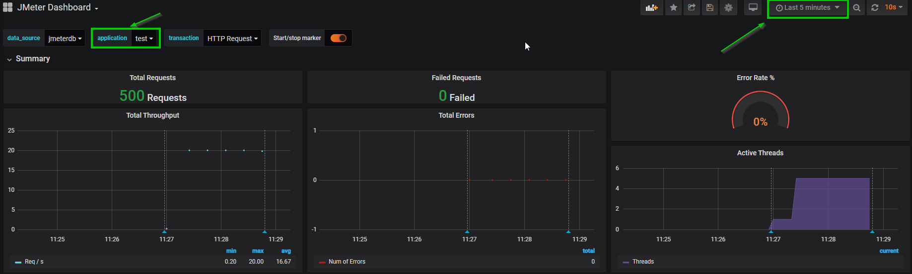


## Writing your own Jmeter Test Plan
### Jmeter Test Plan Setup

This page does not provide full details of how to create a Jmeter test plan - refer to the Apache Jmeter documentation for this purpose, however the key element to include into the test plan is a BackendListener configuration

#### BackendListener Configuration

The Jmeter BackEndListener needs to be configured to send data to InfluxDB to allow the real-time metrics


Select the correct Backend Listener Implementation - this needs to be the Influx listener
The influxDb URL must be set to:  http://jmeter-influxdb:8086/write?db=jmeter
Application - this is a name of your choice ( used in the Grafana dashboard to filter )
Measurement - should be set to jmeter

## Running your own tests

### Test Plan
After creating your testplan using a local Jmeter GUI instance save a copy of the testplan to the "deploy" directory
Run the testplan with:
```
 ./starttest.sh {testplan.jmx}
```

### Scaling the Test Framework
The Test Framework is deployed with a single Jmeter Slave node.  To run a larger test ( more slaves ) scale out the jmeter-slaves deployment using:
```
kubectl scale deployments jmeter-slaves --replicas={number required}
```
This will scale the number of slaves ( note the configuration is set to autoscale the cluster and you will need to wait whilst the cluster scales out)
Check the status with:
```
kubectl get deployments -w
```

## Troubleshooting Notes

### Remote Slave does not start
In some instances there may be a scenario where the remote slave cannot be contacted by the master node at test start.  In this case the IP address of the pod will be the last one listed in the remote server list.
- Using the Ip address of the remote slave find the pod using : 
```
kubectl get pods -o wide |grep {ip address}
```


## References
https://kubernauts.io

https://jmeter.apache.org/
